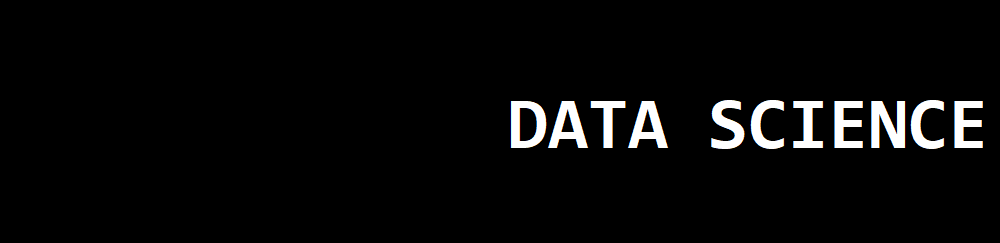

   

  

# Gabriel Travensolli
 Graduado em *Engenharia de Controle e Automação* na UNIFEI e Futuro *Cientista de Dados*

Aficionado por tecnologia desde a infância estudou Engenharia de Controle e Automação, obtendo uma forte base em programação/parametrização de microcontroladores, Arduino, FPGA, CLP’s até robôs móveis e manipuladores robóticos, bem como processos automatizados. Na graduação despertou interesse na análise de dados e modelagem matemática aplicados através da inteligência artificial para realização de projetos de identificação e controle de sistemas a erro nulo de forma adaptativa/preditiva.

Nesta página há links de artigos e projetos relacionados à aplicabilidade da modelagem matemática e interpretação dos dados aos mais variados cenários.

**Background in:** Python, Machine Learning, Matlab, Simulink, Modelagem/Otimização Matemática, Controle de Sistemas,.

**Links:**
* [LinkedIn](https://www.linkedin.com/in/gabrieltravensolli/)
* [Medium](https://medium.com/@g.travensolli)

## Projetos:

---

